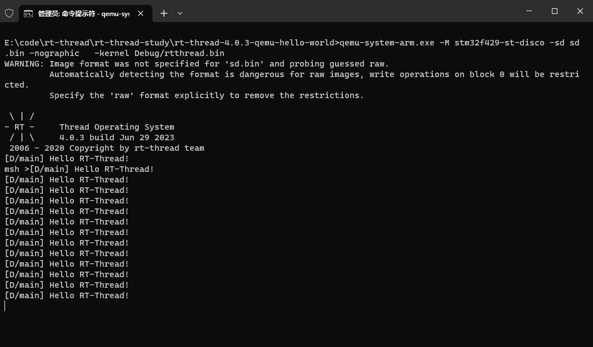

# rt-thread-4.0.3-qemu-hello-world
applications/main.c 
```
#include <rtthread.h>

#define DBG_TAG "main"
#define DBG_LVL DBG_LOG
#include <rtdbg.h>

int main(void) {
  int count = 1;

  while (count++) {
    LOG_D("Hello RT-Thread!");
    rt_thread_mdelay(1000);
  }

  return RT_EOK;
}
```
QEMU Run
